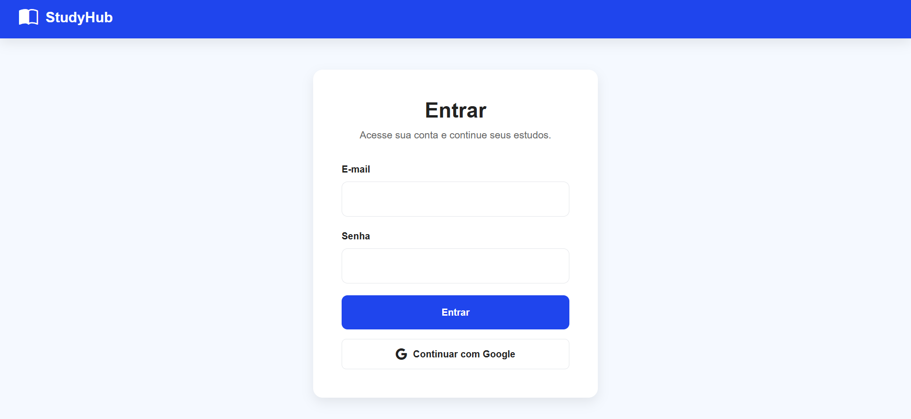
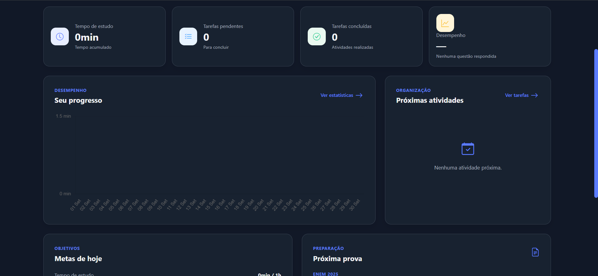
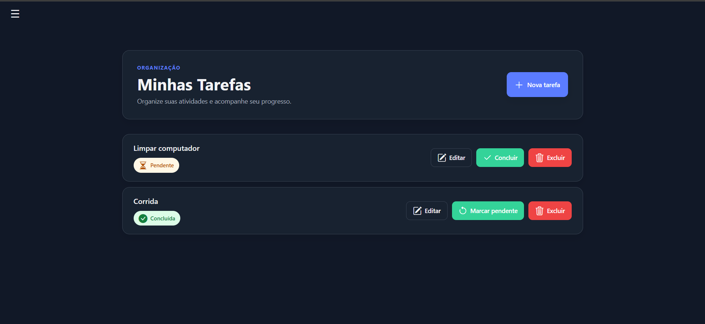
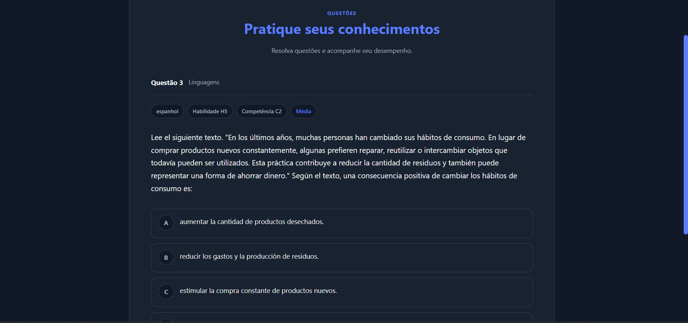
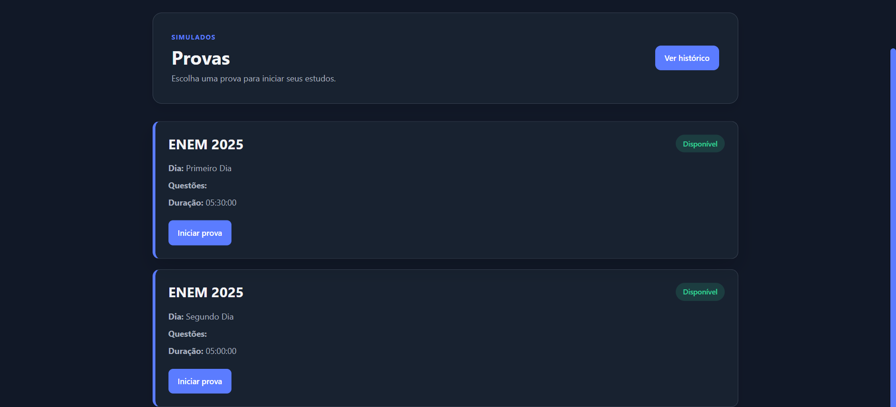
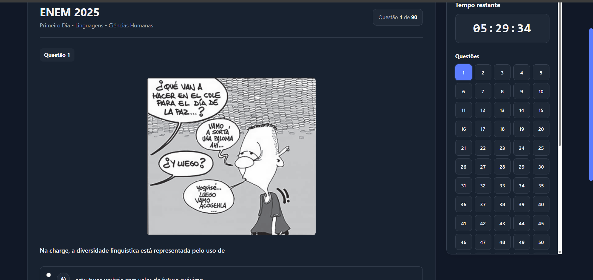

# StudyHub

Sistema web de gerenciamento de estudos desenvolvido em Python com Flask, voltado para organização acadêmica, acompanhamento de estudos, tarefas, questões e provas.

O StudyHub permite que o usuário organize sua rotina de estudos, acompanhe seu progresso e pratique questões de provas do ENEM em uma interface web responsiva.

## Interface

### Autenticação



O sistema possui autenticação por e-mail e senha, além da opção de continuar com uma conta Google por meio de OAuth.

### Dashboard



O dashboard apresenta uma visão geral das principais informações do usuário e centraliza o acesso às funcionalidades do sistema.

### Tarefas



A área de tarefas permite organizar atividades acadêmicas, com recursos para criação, edição, conclusão, reabertura e exclusão.

### Estudos



A área de estudos permite registrar e acompanhar sessões de estudo.

### Provas



O StudyHub disponibiliza provas do ENEM para estudo e prática.

### Questões



A interface de questões permite resolver questões das provas e acompanhar seu histórico e status de resolução.

## Funcionalidades

### Autenticação e conta

* Cadastro de usuários
* Login com e-mail e senha
* Login com Google através de OAuth
* Criação e vinculação de contas Google
* Logout
* Validação de dados de entrada
* Limite de tentativas de login
* Exclusão da conta

### Dashboard

* Visão geral das informações acadêmicas
* Acesso centralizado às principais funcionalidades
* Indicadores relacionados ao progresso do usuário

### Tarefas

* Criar tarefas
* Editar tarefas
* Concluir tarefas
* Reabrir tarefas
* Excluir tarefas
* Organização das atividades acadêmicas

### Estudos

* Registro de sessões de estudo
* Acompanhamento do tempo de estudo
* Gerenciamento dos estudos
* Cronômetro de estudo

### Questões

* Resolução de questões
* Registro do histórico de resolução
* Acompanhamento do status das questões
* Sistema de tentativa posterior para questões já resolvidas

### Provas

* Provas do ENEM
* Questões dos dois dias do ENEM 2025
* Navegação pelas questões das provas
* Resolução e acompanhamento das questões
* Histórico e revisão de desempenho

### Calendário

* Organização das atividades e compromissos acadêmicos
* Visualização das atividades em calendário

### Estatísticas

* Acompanhamento do desempenho acadêmico
* Visualização de informações relacionadas aos estudos e questões

### Configurações

* Configuração da conta
* Preferências do usuário
* Tema claro
* Tema escuro
* Tema baseado no sistema
* Gerenciamento da conta

## Segurança

A aplicação foi desenvolvida considerando práticas básicas de segurança para aplicações web.

Entre as medidas implementadas estão:

* Senhas armazenadas utilizando hash com `bcrypt`
* Proteção contra CSRF utilizando Flask-WTF
* Validação de dados de entrada
* Controle de acesso às páginas privadas
* Sessões autenticadas
* Cookies de sessão com configurações de segurança
* Uso de variáveis de ambiente para informações sensíveis
* Credenciais do banco de dados fora do código-fonte
* PostgreSQL como banco de dados em produção
* Tratamento de tentativas de login
* Isolamento dos dados entre usuários

Informações sensíveis, como a chave secreta da aplicação e as credenciais do banco de dados, não são armazenadas diretamente no código-fonte.

## Tecnologias utilizadas

### Backend

* Python
* Flask
* Gunicorn

### Banco de dados

* PostgreSQL
* Psycopg

### Segurança e autenticação

* bcrypt
* Flask-WTF
* Authlib
* OAuth 2.0 / Google

### Frontend

* HTML
* CSS
* JavaScript
* Bootstrap Icons

### Infraestrutura

* Render
* PostgreSQL

## Dependências

O projeto utiliza as seguintes dependências:

```text
bcrypt
rich
Flask
gunicorn
psycopg[binary]
Flask-WTF
Authlib
requests
```

As versões utilizadas podem ser consultadas no arquivo `requirements.txt`.

## Arquitetura

O StudyHub utiliza uma arquitetura organizada em camadas, com responsabilidades separadas entre aplicação web, regras de negócio, acesso a dados e funcionalidades de segurança.

A estrutura principal do projeto é organizada da seguinte forma:

```text
studyhub/
├── app.py
├── requirements.txt
├── controllers/
│   └── web/
├── services/
├── repositories/
├── security/
├── templates/
├── static/
└── docs/
    └── images/
```

### Estrutura do projeto

| Diretório/Arquivo | Descrição                                                                                              |
| ----------------- | ------------------------------------------------------------------------------------------------------ |
| `app.py`          | Inicialização e configuração da aplicação Flask, além do registro das rotas e componentes necessários. |
| `controllers/`    | Tratamento das requisições e comunicação entre a camada web e as demais camadas da aplicação.          |
| `services/`       | Implementação das regras de negócio e operações relacionadas às funcionalidades do sistema.            |
| `repositories/`   | Acesso e manipulação dos dados persistidos no banco de dados.                                          |
| `security/`       | Funcionalidades relacionadas à segurança, validação, autenticação e gerenciamento de senhas.           |
| `templates/`      | Páginas HTML utilizadas pela aplicação.                                                                |
| `static/`         | Arquivos estáticos, como CSS, JavaScript e outros recursos da interface.                               |
| `docs/images/`    | Imagens utilizadas na documentação do projeto.                                                         |

## Banco de dados

O StudyHub utiliza **PostgreSQL** como banco de dados.

A conexão com o banco é configurada através da variável de ambiente:

```text
DATABASE_URL
```

Dessa forma, as credenciais de acesso ao banco de dados não são armazenadas diretamente no código-fonte.

Em ambiente de desenvolvimento, o projeto pode utilizar uma instância local do PostgreSQL. No ambiente de produção, o banco de dados é executado junto à infraestrutura de hospedagem da aplicação.

## Configuração do ambiente

Para executar o StudyHub localmente, é necessário ter o **Python** instalado e uma instância do **PostgreSQL** disponível.

### 1. Clone o repositório

```bash
git clone <URL_DO_REPOSITORIO>
cd studyhub
```

### 2. Crie um ambiente virtual

No Windows:

```bash
python -m venv .venv
```

Ative o ambiente virtual:

```bash
.venv\Scripts\activate
```

No Linux/macOS:

```bash
source .venv/bin/activate
```

### 3. Instale as dependências

```bash
pip install -r requirements.txt
```

### 4. Configure as variáveis de ambiente

Configure as variáveis necessárias para o funcionamento da aplicação:

```text
SECRET_KEY
DATABASE_URL
```

Para utilizar a autenticação com Google, também é necessário configurar as credenciais OAuth correspondentes.

### 5. Execute a aplicação

Execute a aplicação em ambiente de desenvolvimento:

```bash
python app.py
```

Após a inicialização, a aplicação estará disponível no endereço local configurado pelo Flask.

## Deploy

A versão de produção do StudyHub utiliza **Render** como plataforma de hospedagem.

A aplicação é executada utilizando **Gunicorn** e utiliza **PostgreSQL** como banco de dados.

As informações sensíveis são configuradas através das variáveis de ambiente da plataforma de hospedagem.

Comando utilizado para iniciar a aplicação:

```bash
gunicorn app:app
```

## Responsividade

O StudyHub possui uma interface web responsiva, permitindo a utilização em diferentes tamanhos de tela, incluindo **computadores, tablets e dispositivos móveis**.

As páginas foram desenvolvidas considerando a adaptação da interface para diferentes resoluções.

## V1

A versão 1.0 do StudyHub contempla:

* Cadastro e login de usuários
* Autenticação com Google
* Dashboard
* Gerenciamento de tarefas
* Gerenciamento de estudos
* Questões
* Provas do ENEM
* Calendário
* Estatísticas
* Configurações da conta
* Temas claro, escuro e sistema
* Proteções de segurança e controle de acesso
* Interface web responsiva

## Objetivo do projeto

O StudyHub foi desenvolvido como um projeto de aplicação web para colocar em prática conceitos de desenvolvimento de software e desenvolvimento web, incluindo:

* Desenvolvimento com Python
* Desenvolvimento web com Flask
* Arquitetura em camadas
* Banco de dados relacional
* Autenticação e autorização
* OAuth
* Segurança de aplicações web
* Desenvolvimento de interfaces responsivas
* Deploy de aplicações web
* Organização e manutenção de projetos de software

## Status

**Versão 1.0 — Concluída**

A primeira versão do StudyHub está concluída e publicada em ambiente de produção.
O projeto encontra-se em fase de testes, ajustes e aprimoramentos após o deploy.
Novas funcionalidades e melhorias poderão ser adicionadas em vers

## Autor

**Guilherme Freitas**

Projeto desenvolvido para fins de estudo, prática e construção de portfólio em desenvolvimento de software.